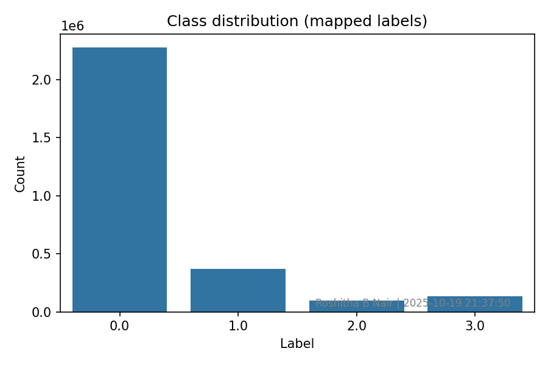

# Consumer Complaints Classification Project
---
## Project Overview

This project classifies consumer complaints into four categories using machine learning:
- Credit Reporting
- Debt Collection
- Consumer Loan
- Mortgage

It leverages text preprocessing, TF-IDF vectorization, and machine learning models including Logistic Regression, Random Forest, and XGBoost. The best-performing model is automatically selected and saved for predictions.


## Folder Structure

```text
task5-consumer-complaints/
│
├─ data/
│   └─ consumer_complaints.csv        # Original dataset (not uploaded to GitHub)
│
├─ outputs/
│   ├─ best_model.joblib              # Best model after training
│   ├─ vectorizer.joblib              # TF-IDF vectorizer
│   ├─ rf_model.joblib                # Random Forest model
│   ├─ logreg_model.joblib            # Logistic Regression model
│   ├─ xgb_model.joblib               # XGBoost model
│   ├─ confusion_rf.png               # Confusion matrix for Random Forest
│   ├─ confusion_logreg.png           # Confusion matrix for Logistic Regression
│   ├─ confusion_xgb.png              # Confusion matrix for XGBoost
│   ├─ class_distribution.png         # Class distribution visualization
│   ├─ top_tokens_label_0.png         # Top words for label 0 (Credit Reporting)
│   └─ samples_label_0.txt            # Sample complaint texts per class
│
├─ notebooks/
│   └─ eda_script.py                  # Exploratory Data Analysis & visualization
│
├─ src/
│   ├─ preprocess.py                  # Text cleaning, label mapping, train/test split
│   ├─ train.py                       # Training pipeline
│   └─ predict.py                     # Predict new complaint category
│
├─ .gitignore                         # Ignore dataset and large files
└─ README.md
```


## Technologies Used

| Technology | Purpose |
| :--- | :--- |
| **Python 3.9** | Core programming language |
| **Scikit-learn** | ML models (LogReg, RF), TF-IDF, metrics |
| **XGBoost** | ML model (Gradient Boosting) |
| **Pandas** | Data loading and manipulation |
| **NLTK** | Text preprocessing (stopwords, lemmatization) |
| **Matplotlib/Seaborn**| Data visualization (confusion matrix, distributions) |
| **Git LFS** | Tracking large model files |


## Installation & Setup

**1. Clone the repository**
  ```bash
git clone https://github.com/roshitha-nair/task5-consumer-complaints.git
cd task5-consumer-complaints
```
**2. Create and activate virtual environment**
```bash
python -m venv venv        # Create
venv\Scripts\activate      # Windows
# source venv/bin/activate # macOS/Linux

```
**3. Install required packages**
```bash
pip install -r requirements.txt
```

## Exploratory Data Analysis (EDA)
Run the EDA script to generate visualizations:
```bash
python notebooks/eda_script.py
```
Outputs saved in **outputs/:**
- Class distribution bar chart (**class_distribution.png**)
- Top tokens per label (**top_tokens_label_0.png etc.**)
- Sample texts per class (**samples_label_0.txt etc.**)


## Training the Models

1. Place your dataset [consumer_complaints.csv](https://www.consumerfinance.gov/data-research/consumer-complaints/) in the **data/** folder.
2. Run the training script:
    ```bash
    python src/train.py data/consumer_complaints.csv
    ```
3. Optional: To use a smaller sample (for faster testing):
    
     ```bash
    python src/train.py data/consumer_complaints.csv 50000
    ```
    ### What happens during training:
    
   - Text is cleaned and preprocessed
   - Labels are mapped to 0–3
   - Train/test split is performed
   - TF-IDF vectorizer is built
   - Three models are trained:
     - Logistic Regression
     - Random Forest
     - XGBoost
   - Confusion matrices and visualizations are saved to **outputs/**
   - The best model (by macro F1-score) is saved as **best_model.joblib**
   - Vectorizer is saved as **vectorizer.joblib**
    
## Making Predictions

```bash
python -m src.predict "Enter your complaint text here"
```
**Example output:**
```bash
Predicted label: <Credit Reporting | Debt Collection | Consumer Loan | Mortgage>
```
- Replace the text in quotes with your actual complaint.
- The script will automatically classify it into one of the four categories.

## Key Visual

Here is the distribution of the four target classes in the dataset.



## Deployment Notes
 - Large files (**model .joblib**) are tracked using Git LFS.
 - Dataset (**consumer_complaints.cs**) excluded due to GitHub’s file size limit
 - Scripts modularized under **src/** for scalability and readability
 - TF-IDF vectorizer and best model are saved in **outputs/** for predictions.
 - Screenshots of terminal outputs and visualizations can be added in **screenshots/** for company submission.

## Version Control

- Repository maintained on GitHub
- All large files tracked using Git LFS
- Git best practices followed (commit messages, .gitignore, structured folders)

## Contact
**Developer:** Roshitha B Nair<br>
**Email:** [roshithababuplus@gmail.com](mailto:roshithababuplus@gmail.com)


